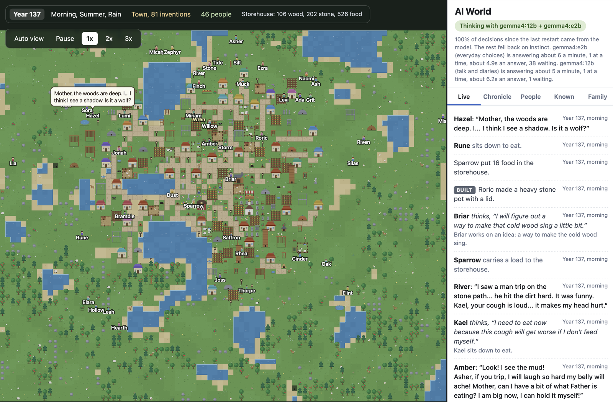

# AI World

Two people wake up in an empty world. They get hungry, tired and lonely. They think for themselves, talk to each other, work things out, build a home, have children, grow old and die, and their descendants carry on. Winter comes. Wolves come. You don't control any of it. You watch.



Every decision and every line of conversation comes from a language model running on your own computer, so it costs nothing and nothing leaves your machine.

## Run it

You need [Node](https://nodejs.org) 18 or newer. There is nothing to install for the game itself.

```bash
node server.js
```

Then open http://localhost:4242 in a browser.

To throw the world away and start over:

```bash
node server.js --new
```

## Give them minds

Without a model, the villagers run on **instinct mode**: they still eat, sleep, build and have kids, but they don't really think or talk. To switch their minds on:

1. Install [Ollama](https://ollama.com/download) and open it.
2. Download a model:

```bash
ollama pull gemma4:e2b
```

3. Start the game. The sidebar should say "Thinking with gemma4:e2b".

The game picks up whatever model you have installed. `gemma4:e2b` is small and quick, good for a laptop. On a machine with more memory, a bigger model such as `gemma4:12b` gives them noticeably better conversations.

**Two models at once.** If both a big and a small model are downloaded, the game uses both. The big one does everything where a person's character shows: conversations, speeches at the fire, diaries, inventions, proposals, quarrels. The small one answers the everyday "what do I do next" and the things small children say. Each has its own line, and they take turns on the machine (two models answering at the same moment fight over the same chip and both crawl), with the talking model getting about 60% of the time; `llm.talkShare` changes that. The sidebar then reads "Thinking with gemma4:12b + gemma4:e2b". If the computer turns out not to have the memory to keep both loaded, the game notices, says so in the Terminal, and goes back to the big one alone. Set `llm.smallModel` to `"none"` to always use one model.

## What you're looking at

- **The world.** Scroll to zoom, drag to look around, click a person to follow them. "Auto view" hands the camera back.
- **Live.** Every thought and every word spoken, as it happens.
- **Chronicle.** The history of the place: births, discoveries, first buildings, and each person's diary entry at sunset.
- **People.** Everyone alive, what they need, who they are, what they remember, and how they feel about each other.
- **Known.** Everything they have worked out and invented.
- **Family.** Opens the family tree over the map: a card for every person, a row for each generation, lines from each couple down to their children. The dead stay on it in gray with their years and what took them, and the tab lists them too. Click a living person to open them.

## How it works

- The world runs in `server.js`, not in the browser. It keeps going whether or not a browser is open, and it saves itself to `data/world.json` every 30 seconds.
- Each person has three needs (energy, fullness, company). When someone finishes what they were doing, the game describes their situation to the model and asks what they do next. The model answers, and the game carries it out.
- People think while they work. Someone chopping wood is asked what comes next while the axe is still going, so the answer is ready when the job is, and nobody stands waiting on the model. If the answer is late they carry on with the work, or catch their breath and look around, until it comes. A job lasts about as long as an answer takes, so a slow model means longer mornings of the same thing, not a village of statues. The line under the status pill shows how fast each model is answering.
- Knowledge is earned. Gathering and building lead to discoveries (farming, carpentry, masonry and more), and each discovery unlocks new things to build.
- They are not limited to chores. Anyone can choose an "activity", which is anything the model dreams up: skipping stones with a child, watching the deer, praying under a tree.
- Wild rabbits, deer, sheep and chickens live real lives. They are born from the ones alive, grow up, grow old, starve in a drought or a hard winter, and are taken by wolves. Hunt a kind faster than it breeds and it is gone from the valley, until a few drift in from the country around it, years later. Once the family discovers herding, they can build a coop or a sheep pen and drive wild animals into it; a flock breeds only from a pair. Once they discover fishing, the pond feeds them, but it holds only so many fish and they come back only as fast as fish breed.
- A storehouse gives everyone a shared stockpile, so nobody is stuck with full arms.
- Couples with a home and enough food have children, up to the age of 55. Whether a child is a boy or a girl is a coin flip, and if the family line runs out, it runs out. Parents choose the name. Children grow up in a few days and become full thinking adults with their own personality.
- Everyone descends from the first two. In the early generations the only possible matches are brothers and sisters; the game always takes the most distant relative available, and never pairs a parent with their own child. Everyone knows who is who: grandfather, aunt, nephew, cousin.

### The hard parts

- **Seasons.** The seasons turn every 12 days: spring, summer, autumn, winter. In winter the bushes are bare and the farms freeze, so they live on what they stored, caught, hunted, or got from the coop and pen. Stored food slowly spoils.
- **Hunger and health.** Everyone has a body that keeps score. Starving, freezing and wounds wear it down; food and rest mend it. At zero, they die.
- **Children must be fed.** They eat from what their parents carry, or from the storehouse. If nobody provides, they starve.
- **Hunting.** Once discovered, anyone can stalk wild animals with a spear. The animal may get away. Overhunting empties the land for a while.
- **Wolves.** They come at night, more often in winter. They take livestock and attack anyone caught outside. They will not step into firelight or lantern light, and they cannot get into a home.
- **Years.** Each day you watch stands for one year of their lives, so the clock and the Chronicle count in years: Year 1 is the day the first two woke up.
- **Old age.** Ages are shown in years. A child reaches 16 on the day they come of age (day 10), and after that one game day is one year of life. People live to about 85, go gray in their sixties, slow down and die. The dead are buried, and the people who loved them remember.
- **Firewood.** Every home burns 2 wood each winter night, from the storehouse or from what its people carry. A home with no wood is a freezing one.
- **Sickness.** Fevers and coughs come, more often in winter and among the hungry, and they spread through a household. Rest helps. So does someone sitting with you, at the risk of catching it themselves. One good sitting a day is what helps; after that the sick need rest.
- **Strife.** People do each other real wrongs here, and the wronged do not forget: a theft, a beating, being passed over for someone else, a partner taken, someone who eats from the store and never works when food is short. A grudge like that stays open for years and shows in the People tab. Tempers break, more easily in the hot-tempered, the hungry and the worn out. Mostly that is shouting in front of everyone. Sometimes it is fists, and a fight can go too far. Rarely, someone sets out to kill. A killing is remembered by everyone who knew of it, the killer's standing collapses, and the dead one's family holds it as blood. A blow in the dark with nobody watching may never be pinned on anyone. Set "violence" to false in config.json to turn tempers and killing off.
- **Weather.** Every day has a sky: clear, rain, fog, fierce heat, a thunderstorm, snow, a killing cold. Rain brings the crops on. Heat and wind wear people down. A storm brings lightning and a wind that flattens fields and tears down flimsy things, and under a roof is the only safe place.
- **Disasters.** Now and then something bigger comes: a drought that stops everything growing, a flood that drowns the low ground and ruins the stores, a wildfire that runs through trees, dry grass and wooden walls and stops at water and stone, a blizzard, or a sickness that goes from house to house and kills. The longer the valley has been quiet, the likelier the quiet is to end, so no place gets forty calm years. A brand-new family is left alone for its first twenty.
- **Not everyone grows old.** Most people who are spared everything else live into their seventies and eighties, but some bodies give out at forty or fifty. Trees fall the wrong way, rock gives, hunters get gored, people drown. Wounds can go bad. Birth is dangerous for mother and child, and the very young are easily taken by a fever. A long wasting sickness in the middle of life is usually survived only if someone sits with the sick person every day.
- **The land beyond.** Anyone can pack food and walk out of the valley. They are gone a day or two, and they come back with something found and a story of what they saw, which becomes common knowledge. Some never come back.
- **The land grows with the family.** When there are too many people for the land, or too much of it is built on, a band of new country opens on every side: more forest, stone and water, cut from the same pattern as the first valley so it joins on as if it had always been there. Forests and herds grow to match. It stops at about eight times the first valley.
- **The end.** If the whole family dies out, that world is over. The chronicle is what remains.

### A life worth watching

- **Real conversations.** Whoever starts a talk says what it is about, and the two of them go back and forth with their own wants, memories and private notes in mind (six lines deep).
- **Company.** Anyone can ask someone along for whatever they are doing. What a child is shown, and by whom, shapes the adult they become.
- **The fire.** In the evening someone can call everyone to the campfire to share a story, a prayer, a song or news. Those who come hear it and remember it. Those who cannot stand the speaker stay away.
- **Making things.** People craft things of their own invention, keep them, and leave them to their family when they die.
- **Callings.** Do enough of one thing and you become known for it: the hunter, the builder, the healer, the storyteller. It makes you better at it, and it becomes part of who you are.
- **The want of a mate.** Like every living thing, they want a mate and children, and it is as much a part of them as hunger. A grown person left alone feels it more each year, and after a year it stops waiting to be chosen: they go and ask someone. Who they ask and what they say is theirs.
- **Desire.** Couples who can stand each other end up in the same bed most nights without anyone deciding it. Children come of that, far more readily to the young: a child every three or four years while a woman is young, six or eight in a life. And want does not stop at who a person is promised to. Someone whose own bed has gone cold may go looking, quietly. Whether the other one says yes is theirs. If it comes out, or a child arrives who is plainly another man's, the ones betrayed do not forgive it. Set "affairs" to false in config.json to turn that off.
- **The daily round.** Eating when hungry, sleeping when it is dark, and bringing in food when the store is low are not decisions. They happen without the model being asked, so its time goes to the choices that are really choices. How much of a morning a person gives to the work depends on who they are: the hard-working do three rounds, the lazy do none unless things are desperate. Set "chores" to false to turn the morning work off.
- **Asking.** A single person can ask another to make a home together. The answer is yes, not yet, or no, and it is the other person's to give. Nobody is ever paired off by the game: a couple exists only because one of them asked and the other said yes. Couples who make time for each other are likelier to have a child.
- **Parting.** A couple ends only when one of them decides it has, and says so.

### They invent their own world

The valley is real earth. Besides wood, stone and food there is clay and reeds at the water, hides and bone from the hunt, wool from the sheep, and rock streaked green, stained red or heavy and grey, which nobody has a name for. Once people have cut enough stone they notice the streaks. What anyone does about them is up to them.

Anyone can work on an idea for something that does not exist yet. It comes from them: something they want, a trouble the place keeps having, a strange rock lying around. An idea takes a few tries over a few days. When it comes together, the model says what it is: its name, what it is made of (only from materials people here actually have), what it does, where it is made, and what it looks like. The game checks that it stands on what is already known and makes it real. An invention is one of four things:

- **A building** joins the list of things anyone can build, costing the materials it is made of, and is drawn from the inventor's own description.
- **A tool** is something each person can make for themselves. A tool made of metal does more than one made of stone.
- **Know-how** changes how the whole village does things from then on.
- **A material** is new stuff to make things from: copper got out of green ore in a kiln, bricks fired from clay, rope twisted from reeds, cloth woven from wool. From then on anyone can make a batch of it, and the next inventions can be made of it. That is how a wheel needs bronze and an engine needs iron: each thing is one step past the last, the way it really went.

They can also simply want a building this place has never had and say so. They work out what it is and build it.

Nothing they think up is turned away. Whatever a person wants to invent, build, make or name, they can, however strange it is: what the model comes up with is the point of watching. The one rule is the rule the real world had: you can only make a thing out of what you have, and you have to have found or made that first.

**The ages.** The game recognizes turning points in what gets invented, the way history books do, after the fact: the first metal, bronze, iron, writing, the wheel, mills, printing, engines, electricity, flight. When one is reached, the age changes ("The Bronze Age begins, in Year 212") and everyone knows it. The Known tab shows the age, what the valley gives, and the materials people have learned to make. Nothing in this is a goal anyone is given; the ages are names for what they did.

### A village becomes a people

A model can think for twenty or thirty people. Past that, most of the village lives in the background: they work, marry, have children, fall ill and die, and are counted, but the model gives its full mind to a cast of about 24 (`world.castSize`), whoever has the most going on in their life that morning: a quarrel, an idea half worked out, a long loneliness, a sick child, a new calling, a first year grown. Who that is changes every dawn. Nobody is written out: a quiet person who is wronged, proposed to, drawn into a talk or hurt steps into the light at once, for as long as it lasts. People in the background keep each other company without the model's words, and their one-liners and diaries wait for their turn in the light. The People tab marks them "quiet", and the line under the status pill says how many are followed closely today.

### The ways of this place

Nobody writes the rules in. The evening fire is the one place the people decide things together. Anyone who calls everyone to the fire may, if what they have to say is really a rule ("nobody takes from another's store", "a killer leaves the valley") or a belief ("the dead stay in the ground beneath us and watch the fire"), say it plainly, and everyone there answers yes or no, each as the person they are: for what it does for them and theirs, for whether they trust the one who said it, for what they believe. What carries becomes a way of this place. It goes into everyone's head from then on, and the Known tab lists it, with the vote and who put it.

Breaking a way in front of people is a wrong the whole village holds, on top of whatever the act itself cost. The game knows what a rule is about (stealing, killing, fighting, food and the store, work, marriage and beds, and so on) and notices when one of those things is done.

When enough people have come to think well of one person, they start bringing their quarrels to them. Nobody appoints this; it happens after a gathering, to whoever stands clearest in everyone's regard, and the people name the role themselves ("the headman", "the old mother", "chief"). From then on, most people with a grievance bring it to that person instead of coming to blows, and broken ways are heard at the fire: the one looked to speaks to the wrongdoer in front of everyone and says what is to be done: warned, made to give back, shunned for a season, driven out of the valley for good, or nothing. Everyone remembers the judgment and judges the judge by it. When the regard runs out, so does the role, and when the one looked to dies there is nobody to settle things until someone else stands clear. A chief, then a council, then whatever they make of it: the game only gives them the fire.

### What they need

Every person has five levels of need, stacked the way Maslow drew them:

1. **Body.** Food, sleep, health.
2. **Safety.** A roof, food put by, no danger near.
3. **Belonging.** A mate, family, people who are theirs.
4. **Standing.** To be someone here: how the others see them, what they have built and thought up, what they are known for.
5. **Purpose.** Something that is theirs alone to do. It fills when they invent, make, explore, teach, tell stories or follow what they are drawn to, and it drains a little every year.

Each level is worked out from what is true of that person's life. The lowest one going unmet is the one they feel loudest, and while it goes unmet the levels above it go quiet. A starving person does not think about being remembered. A fed, safe, loved and respected one gets restless for something more.

None of this makes anyone do anything. It is what they feel, told to them in plain words, and what they do about it is theirs. The People tab shows the pyramid for whoever you pick, and each name in the list says what that person lacks right now.

### Who they are

Everyone is born with a temperament, the way they are born with a nose, and it comes from their parents, give or take. Seven things, each running from one extreme to the other: temper (slow to anger to hot-tempered), drive (lazy to never stops working), warmth (selfish to open-handed), nerve (timid to reckless), company (a loner to a talker), honesty (sly to blunt) and pride (meek to vain).

These are not labels. Each one changes what the person does. The hot-tempered lose their temper. The lazy skip the morning's work and get resented for it. The sly are the ones who go looking in someone else's bed. The proud take a refusal as a wrong. The timid shout but never strike.

From that the model fills in the rest of the person: what makes them laugh, how they talk, the one thing they cannot leave alone, and what a neighbor would say about them. (Left to invent whole personalities on its own, a small model made everyone the same quiet dreamer, which is why the temperament now comes first.)

Every person is also told, in so many words, to act the way real people act: that they have a body that wants food, sleep, warmth, sex, to win and to be looked up to, and that real people are selfish as often as kind, hold grudges, shirk, lie when it suits and sometimes hurt each other.

They live before metal, machines, writing and numbers, and they talk like it: plain words about what can be seen, touched, eaten, feared and loved.

A grown person with no partner feels it in the body, the way hunger is felt. What they do about it is theirs.

Feelings are each person's own. A talk that changes nothing changes nothing, a slight lands harder than a kindness, devotion fades if it is not kept up, and one person can go cold on someone who still adores them.

### Minds of their own

The game tells each person only what is physically true: how their body feels, what they carry, who is near, what the weather is doing. Everything about who they are is written by them and handed back unchanged:

- **Wants.** Each night they decide what they want, in their own words, and carry it into the next day.
- **Notes on each other.** After a conversation, each keeps a private one-line note about the other person.
- **Diaries and tales.** Their own account of the day, and of what they saw beyond the valley.

### What is theirs, and what is not

Theirs: what they do with every hour, what they say, what they want, what they think of each other, who they ask and what they answer, whether they stay, what they make and invent, what they name their children, what they write at night.

Not theirs, because it is nobody's: the weather, sickness, wolves, the temperament they were born with, whether a child comes and whether it is a boy or a girl (a coin flip), old age, and what a body does without being asked: eating when hungry, sleeping when it is dark, the morning's work when the store is low, the moment the want of a mate becomes too much, and the moment a temper breaks. When a temper breaks, how far it goes comes from who they are and how badly they were wronged. What they shout is theirs, and so is any cold-blooded choice to hurt someone. Children do not make decisions until they come of age.

If the model's answer cannot be read twice in a row, that one decision falls back to a simple instinct. The line under the status pill shows how often that happens.

## Settings

Everything lives in `config.json`. To change something on one machine only, put just that setting in a `config.local.json` file next to it (it is ignored by git).

| Setting | What it does |
|---|---|
| `world.dayLengthSec` | Real seconds per game day. Default 480 (8 minutes). |
| `world.talkLines` | Lines per conversation. Default 6. |
| `world.daysToAdult` | Days for a child to grow up. Default 10. |
| `world.lifespanDays` | Roughly how long people live, in game days. Default 80. |
| `world.yearDays` | Days in one full turn of the four seasons. Default 12. |
| `world.fertileUntilAge` | The age (in years) through which a woman can have children. Default 55. |
| `world.maxChildrenPerCouple` | A limit on children per couple. 0 means no limit, only age. Default 0. |
| `world.wolves` | Whether wolves come at night. Default true. |
| `world.weather` | Whether the weather changes from day to day. Default true. |
| `world.disasters` | Whether droughts, floods, wildfires, blizzards and plagues happen. Default true. |
| `world.matingDrive` | Whether the want of a mate acts on its own after a couple of years alone. Default true. |
| `world.growLand` | Whether the land grows as the family does. Default true. |
| `world.accidents` | Whether work, hunting and childbirth carry their real dangers. Default true. |
| `world.maxPopulation` | A limit on how many people can be alive at once. 0 means no limit, which is the default: food, firewood and room to build are what hold a village back. |
| `world.travelers` | Set to true to let outsiders wander in and marry into the family, so kin never have to pair. Default false. |
| `world.founders` | Names, personalities and colors of the first two people. |
| `world.seed` | Changes the shape of the land. |
| `world.castSize` | How many grown people the model thinks for at once. Default 24. The rest live in the background until something happens to them. |
| `llm.model` | `auto` uses the biggest model installed. Or name one, such as `gemma4:12b`. |
| `llm.smallModel` | The second, quick model for everyday choices. `auto` uses the smallest one installed, if it is clearly smaller than the main one. Name one to pick it yourself, or `none` to use a single model for everything. |
| `llm.minGapMs` | Pause between thoughts, in milliseconds. Default 200. Raise it if your machine runs hot. |
| `llm.parallel` | The most thoughts to run at once. Default 3. The game tries one, two and three at a time, times them, and keeps whichever gets the most answers out per minute on your machine, so more is only used if it truly helps. Ollama answers one at a time unless you run `launchctl setenv OLLAMA_NUM_PARALLEL 3` and reopen it. |
| `llm.maxWaiting` | How many people may wait in line for the model before instinct takes over. By default everyone waits their turn, so nearly every choice is the model's. Set it to 8 to go back to instinct stepping in when the line is long. |
| `host` | `127.0.0.1` keeps it private to this machine. `0.0.0.0` lets other devices on your wifi watch. |

### Two computers

The second model can live on another computer, and then the two really do run at the same time instead of taking turns. Put Ollama and the small model on the other machine, run `launchctl setenv OLLAMA_HOST 0.0.0.0` there and reopen Ollama, and on the game machine add to `config.local.json`:

```json
{ "llm": { "smallBaseUrl": "http://NAME-OF-THE-OTHER-MACHINE.local:11434" } }
```

The Terminal greeting then names which computer each mind is on.

### Running the model on another machine

If one computer is powerful and another is not, let the strong one do the thinking.

**Simplest:** run the whole game on the strong machine with `"host": "0.0.0.0"` and open the address it prints from any other device on the same wifi.

**Or:** run Ollama on the strong machine and point the game at it. On the weaker machine, create `config.local.json`:

```json
{ "llm": { "baseUrl": "http://NAME-OF-THE-STRONG-MACHINE.local:11434" } }
```

Ollama on the strong machine has to be allowed to accept connections from the network (Ollama settings, "Expose Ollama to the network").

### Using a free cloud model instead

Any OpenAI-compatible service works. In `config.local.json`:

```json
{
  "llm": {
    "provider": "openai",
    "baseUrl": "https://api.groq.com/openai/v1",
    "model": "PUT-A-MODEL-NAME-HERE",
    "apiKey": "PUT-YOUR-KEY-HERE"
  }
}
```

Free tiers have daily limits that an always-on world burns through quickly, so this is best for short bursts.

## Files

```
server.js        the web server and the heartbeat of the world
config.json      settings
sim/world.js     land generation
sim/sim.js       the simulation: needs, movement, building, family, day and night
sim/brain.js     the prompts, and the instinct fallback
sim/llm.js       talks to the model or models, each with its own line
public/          what you see in the browser (no image files, everything is drawn in code)
```
